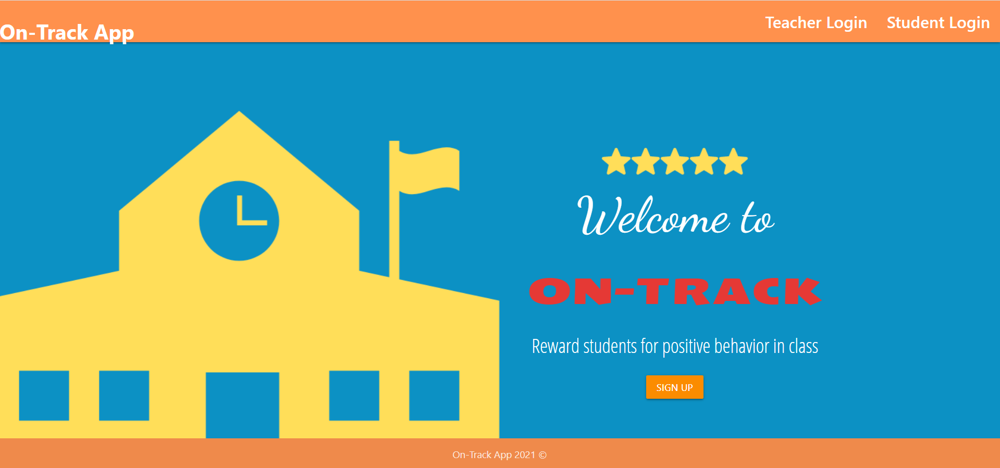

# Project3-Hulk

## Description 

In a world where remote learning is becoming more popular, we feel that this is the perfect time to leverage technology to encourage positive behavior in class whether online or virtually. Statistics show that students this past year have been struggling with online learning and staying focused and motivated. On track is an application to enforce positive behavior in school and to help keep students motivated while working remotely. Remember “back in the day” when you earned stars for good behavior and placed them on a sticker chart or had to pull your “red card” if you got in trouble? Our modern-day approach for the classic star chart is a great way to encourage positivity among students in a virtual + in-person setting. A user is able to access our website as either a teacher or a student. On track is a perfect way to keep communication going between a teacher and student throughout the year.

## Table of Contents 

* [Installation](#installation)
* [Usage](#usage)
* [Credits](#credits)
* [License](#license)

## Installation

In order to access the application, please visit the following site: https://github.com/JenniferFunchess/Project3-Hulk

## Usage 

To use this application as a teacher, sign up at this link:

https://on-track-app-team-hulk.herokuapp.com/

In order to login as a student, you must request your login info (username and class code) from your teacher!

## Credits

Collaborators: 
Shelby Andersen: https://github.com/shelbyandersen
Autin Ellis: https://github.com/Adellis95
Jennifer Funchess: https://github.com/JenniferFunchess
Jonathan Garcia: https://github.com/jgarcia60

## License

MIT License

Copyright (c) [2021] [Shelby Andersen, Austin Ellis, Jennifer Funchess, Jonathan Garcia]

Permission is hereby granted, free of charge, to any person obtaining a copy
of this software and associated documentation files (the "Software"), to deal
in the Software without restriction, including without limitation the rights
to use, copy, modify, merge, publish, distribute, sublicense, and/or sell
copies of the Software, and to permit persons to whom the Software is
furnished to do so, subject to the following conditions:

The above copyright notice and this permission notice shall be included in all
copies or substantial portions of the Software.

THE SOFTWARE IS PROVIDED "AS IS", WITHOUT WARRANTY OF ANY KIND, EXPRESS OR
IMPLIED, INCLUDING BUT NOT LIMITED TO THE WARRANTIES OF MERCHANTABILITY,
FITNESS FOR A PARTICULAR PURPOSE AND NONINFRINGEMENT. IN NO EVENT SHALL THE
AUTHORS OR COPYRIGHT HOLDERS BE LIABLE FOR ANY CLAIM, DAMAGES OR OTHER
LIABILITY, WHETHER IN AN ACTION OF CONTRACT, TORT OR OTHERWISE, ARISING FROM,
OUT OF OR IN CONNECTION WITH THE SOFTWARE OR THE USE OR OTHER DEALINGS IN THE
SOFTWARE.